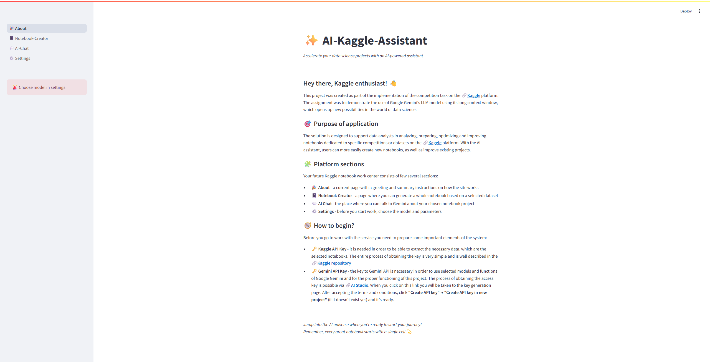

# ✨ AI-Kaggle-Assistant

This project was created as part of the implementation of the competition task on the 🔗[Kaggle](https://www.kaggle.com/competitions/gemini-long-context) platform. <br>
The task was to present an interesting application of Google Gemini's LLM model using its long context window, which opens up new possibilities in the world of data science.

The goal was to demonstrate the model's potential for processing large amounts of data and analyzing complex sets of information. With a long context window, ✨Gemini LLM allows users to work on extensive datasets in a single step, significantly speeding up the analysis process and enabling new applications in data science. This model opens the door to the development of more dynamic, complex and creative applications that can improve data analysis.

## How it works

Your future Kaggle notebook work center consists of two key sections:

- 💬 **About** - page with a greeting and summary instructions on how the site works
- ✨ **AI-Assistant** - your interactive assistant for in-depth notebook analysis. It will give you intelligent suggestions for code, optimization and document structure, fully tailored to your specific competition challenges

⚠️ Before you go to work with the service you need to prepare some important elements of the system:

- 🗝️ **Kaggle API Key** - it is needed in order to be able to extract the necessary data, which are the selected notebooks. The entire process of obtaining the key is very simple and is well described in the **🔗[Kaggle repository](https://github.com/Kaggle/kaggle-api/blob/main/docs/README.md#api-credentials)**
- 🗝️ **Gemini API Key** - the key to Gemini API is necessary in order to use selected models and functions of Google Gemini and for the proper functioning of this project. The process of obtaining the access key is possible via **🔗[AI Studio](https://aistudio.google.com/app/apikey)**.



## Installation

Download a repository

```text
> git clone https://github.com/mateo252/AI-Kaggle-Assistant.git

> cd AI-Kaggle-Assistant
```

Create a virtual environment and install requirements (require Python <= 3.12)

```text
> python -m venv venv

> venv\Scripts\activate

(venv) > pip install -r requirements.txt
```

Create `.env` file and add **Gemini API Key** like `GEMINI_API=...`

Finally run a project

```text
(venv) > cd src

(venv) > streamlit run 💬About.py
```

## License

Apache License 2.0
